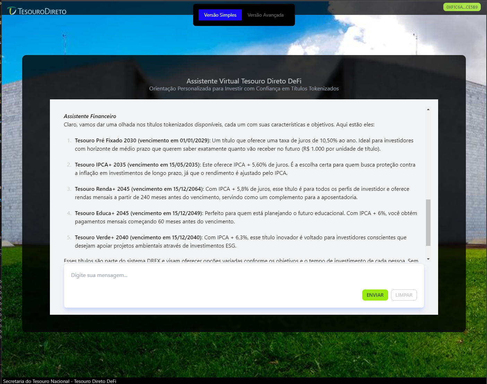
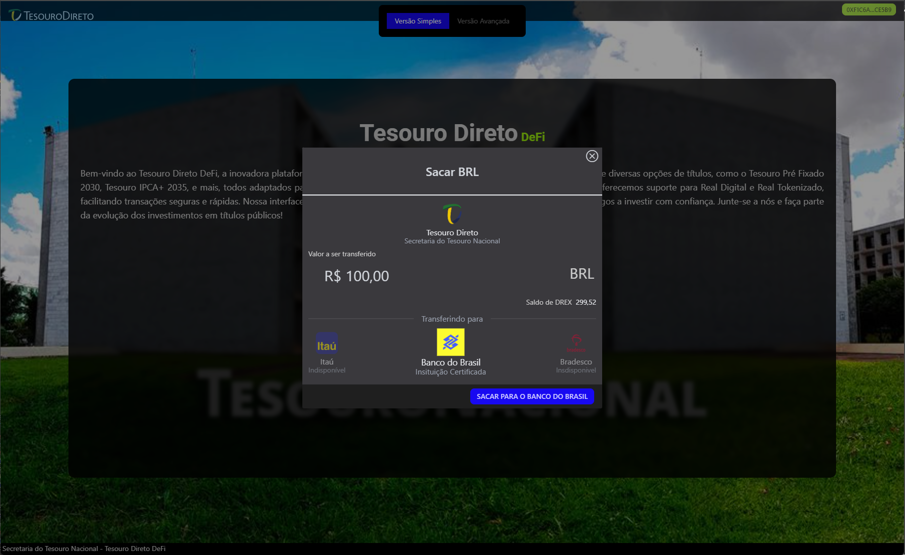
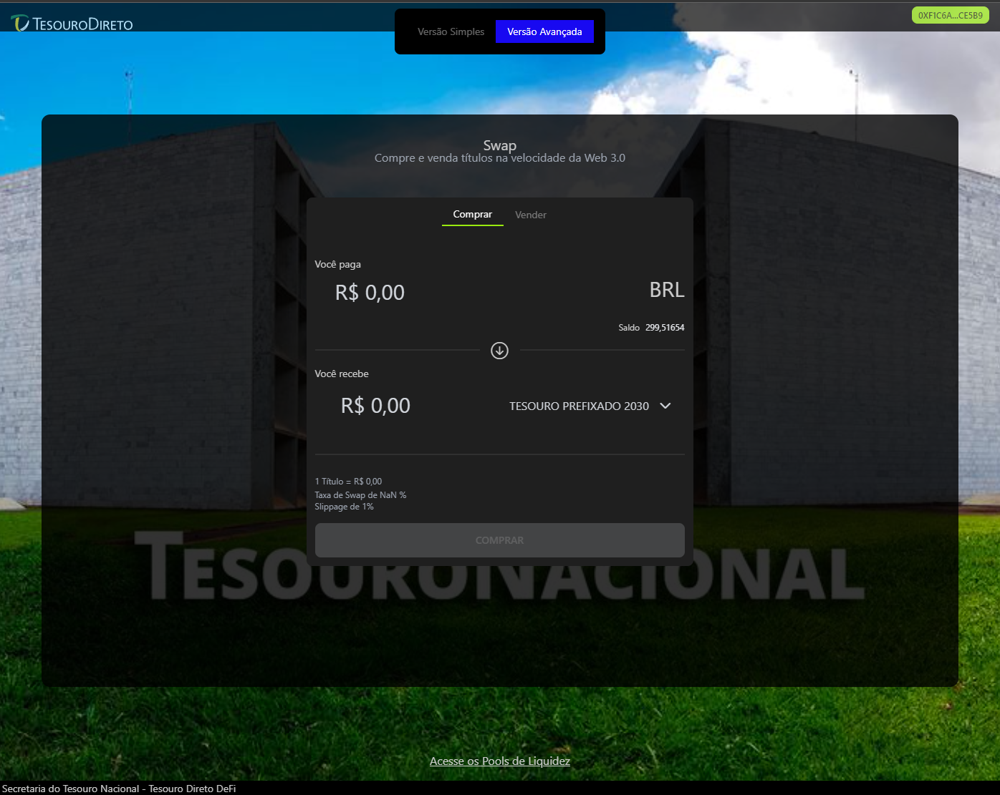
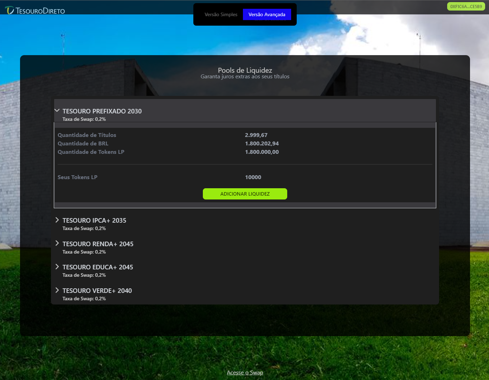

# Tesouro Direto DeFi -
Equipe: 
- Daniel Francisco dos Santos e Silva (Líder)
- Sabrina Kodjaoglanian

## Estrutura do Projeto
Este repositório contém as seguintes pastas:

- `backend`: Código-fonte do backend.
- `contracts`: Smart contracts utilizados no projeto.
- `infra`: Configurações do MongoDB.
- `app`: Aplicativo front-end.

## Sobre o Sistema
O "Tesouro Direto DeFi" é um sistema inovador que oferece uma interface amigável para usuários leigos, com a opção de utilizar uma interface avançada. Utiliza o ChatGPT para orientar os usuários na escolha e investimento em títulos do tesouro direto tokenizados.

## Arquitetura
Foi feito o deploy na Polygon Mumbai (testNet).

Foram implementados as especificações do DREX para total compatibilidade:
- CBDCAccessControl.sol
- RealDigital.sol
- RealDigitalEnableAccount.sol (0x0abafacdb4034ff8847efd682b6e142b542938f4 e 0xddeb0dd9597c2033b4c31faba5eb43f8062d4777)
- RealTokenizado.sol
- SwapOneStep.sol (0x6Dfb383ab3ec9918459a4C3bFb0F432D85B71527 e 0x42d0c0B3B0783C360C726f029c66AD3d214F79CD)
- TPFt.sol (0xcD3b1b15F57225847b4f1FB315308069A230B0e5)
- TPFtAccessControl.sol

### Contrato principal
-  TesouroDireto.sol (0x49C44d6ADE1c5e7733C8B60E892945A5c08dC2B6)

O contrato que faz a integração entre o TPFt e RealTokenizado. Este contrato interage principalmente com o TPFt, que é o responsavel por fazer o mint dos tokens.

Principais funcionalidades do TesouroDireto.sol:

```typescript

    /**
     * @title Interface for TesouroDireto Contract
     *
     * Esta interface define as funcionalidades do contrato TesouroDireto, um contrato inteligente
     * baseado no Ethereum que implementa a lógica de um pool de liquidez para troca de tokens.
     *
     * Principais características:
     * 1. Criação de Pool de Liquidez: Permite a criação de novos pools de liquidez com parâmetros específicos.
     * 2. Adição de Liquidez: Usuários podem adicionar liquidez a um pool existente, recebendo tokens de liquidez em troca.
     * 3. Cálculo de Tokens de Liquidez: Calcula a quantidade de tokens de liquidez a serem emitidos com base no valor depositado no pool.
     * 4. Swap de Tokens: Permite a troca de tokens dentro do pool, com taxas de swap aplicáveis.
     * 5. Consulta de Pools: Fornece informações sobre pools de liquidez específicos.
     * 6. Suporte a Interfaces: Verifica o suporte para interfaces específicas pelo contrato.
     *
     * A constante 'k' no contexto de pools de liquidez é um conceito chave nos Automated Market Makers (AMMs).
     * Em um pool de liquidez AMM, 'k' é o produto das quantidades de dois tipos de tokens no pool (k = tokenA * tokenB).
     * Esta constante é usada para manter a relação de troca entre os tokens, garantindo que o pool permaneça balanceado.
     */


    // Evento emitido quando um novo pool de liquidez é criado
    event newLiquidityPool(uint256 indexed id, LiquidityPool pool);

    // Evento emitido quando liquidez é adicionada a um pool existente
    event LiquidityAdded(address sender, uint256 poolId, uint256 amountTokenA, uint256 amountRealTokenizado, uint256 amountLiquidity);

    // Evento emitido após uma operação de swap bem-sucedida
    event swapped(address sender, uint256 id, uint256 amountIn, uint256 amountOut, bool isTokenAToRealDigital, uint256 newPrice);

     // Cria um novo pool de liquidez
    function createLiquidtyPool(uint256 tokenA, uint256 initialPriceA, uint256 swapFee) external;

    // Adiciona liquidez a um pool existente
    function addLiquidtyPool(uint256 liquidityPoolID, uint256 amountA) external;

    // Calcula a quantidade de tokens de liquidez a serem emitidos para um determinado valor de depósito
    function calculateLiquidityTokens(uint256 realTokenizadoAmount, LiquidityPool memory pool) external pure returns (uint256);

    // Realiza uma operação de swap entre tokens no pool especificado
    function swap(uint256 poolId, uint256 amountIn, bool isTokenAToRealDigital, uint256 minAmountOut) external;

    // Retorna os detalhes de um pool de liquidez específico
    function getPool(uint256 poolId) external view returns (LiquidityPool memory);
    
```
A interface possui duas vesões:
 - **SIMPLES** atráves da consultoria do chatGPT. O assistente te auxilia na instalação do Metamask, transferência de Real tokenizado de Bancos para a plataforma do Tesouro Direto e realiza as operções de simulação, compra e venda.





- **AVANÇADA** para aqueles que já dominam a tecnologia.





## Requisitos de rede
- Wallet MetaMask com saldo de MATIC na rede Polygon (Mumbai TestNet).

## Dicas para Usar MetaMask
Para novos usuários, é recomendado assistir ao vídeo tutorial sobre o uso do MetaMask disponível em [este link](https://www.youtube.com/watch?v=y2ffxrkcaQ4).

## Link da aplicação

